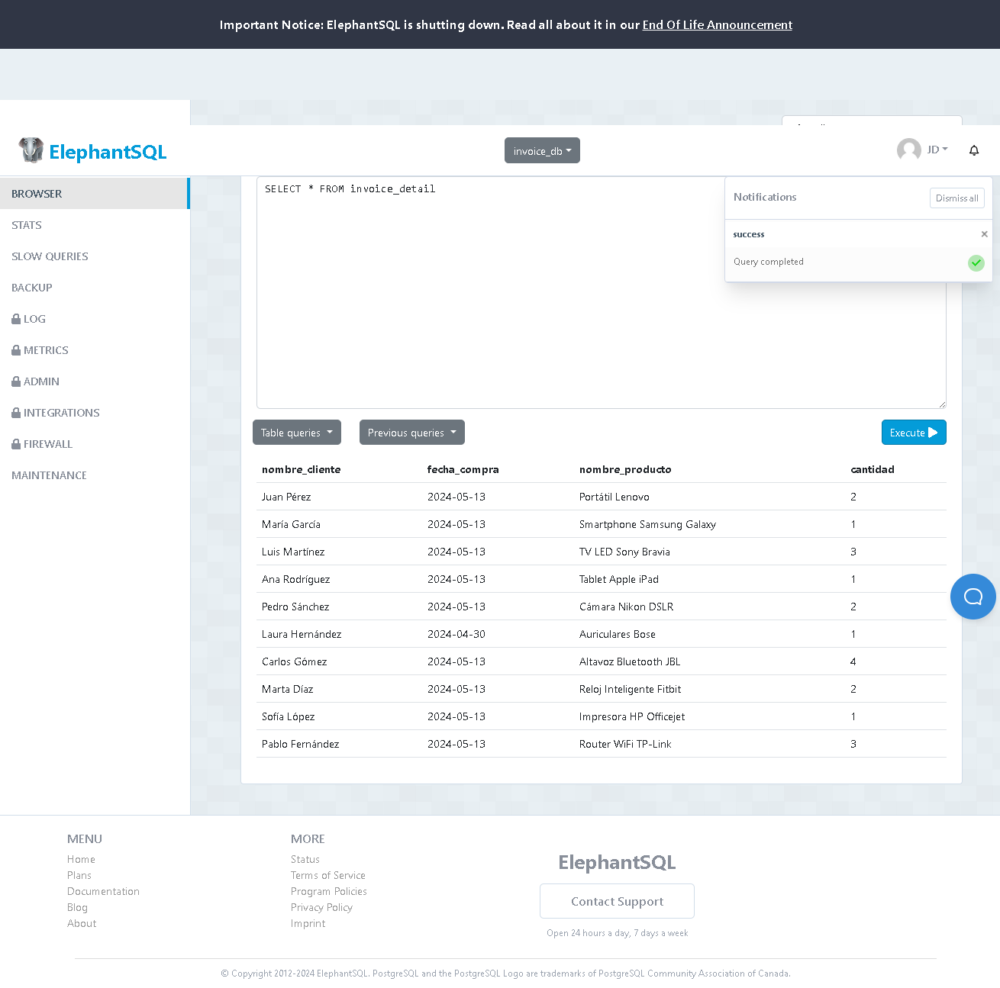

# Deber Semana 12

## Crear una vista que muestre la lista de productos comprados por los clientes con las siguientes columnas: 
          
## Base de datos: invoice
### nombre_cliente | fecha_compra | nombre_producto | cantidad

# Código SQL: 

```
CREATE VIEW invoice_detail AS
SELECT
  client.fullname AS nombre_cliente,
  invoice.create_at AS fecha_compra,
  product.description AS nombre_producto,
  detail.quantity AS cantidad
FROM
  client
JOIN
  invoice ON client.id = invoice.client_id
JOIN
  detail ON invoice.id = detail.invoice_id
JOIN
  product ON detail.product_id = product.id;

```

## Funcionalidad:
### Este código permite unir las 4 tablas existentes en la Base de Datos "invoice" para así obtener una vista que permita al usuario ver el nombre del cliente, junto a la fecha de compra (dato existente en la tabla invoice), nombre_producto (dato existente en la tabla product) y la cantidad del mismo (dato existente en la tabla detail).

## Captura de la sentencia: 


