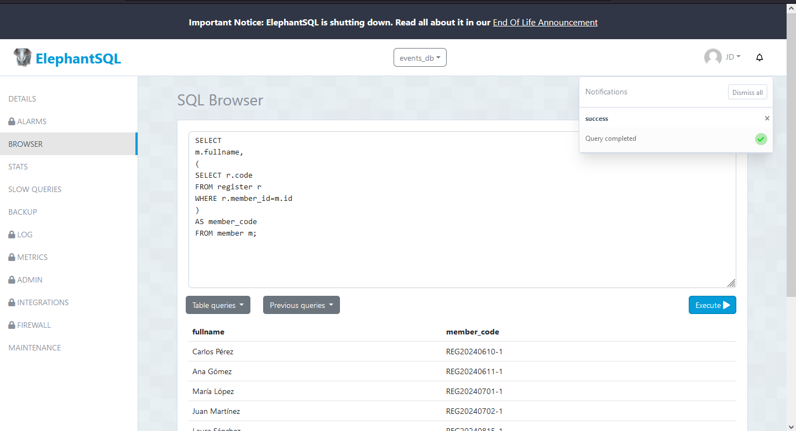
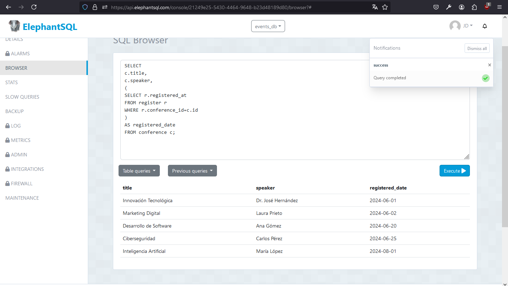

# Actividad en clase Semana 13

## Realizar 2 subconsultas en la Base de Datos "invoice"

### Consulta 1:

```
SELECT 
m.fullname,
(
SELECT r.code
FROM register r
WHERE r.member_id=m.id
) 
AS member_code
FROM member m;
```

### Funcionalidad:

#### Este código permite obtener el nombre de los miembros y el código de registro existente en la tabla "register".

### Captura:




### Consulta 2:

```
SELECT 
c.title, 
c.speaker,
(
SELECT r.registered_at
FROM register r
WHERE r.conference_id=c.id
) 
AS registered_date
FROM conference c;

```

### Funcionalidad:

#### Este código muestra el título y el ponente de la conferencia y la fecha en la que fue registrada dicha conferencia (datos existentes en la tabla "register").

### Captura: 

