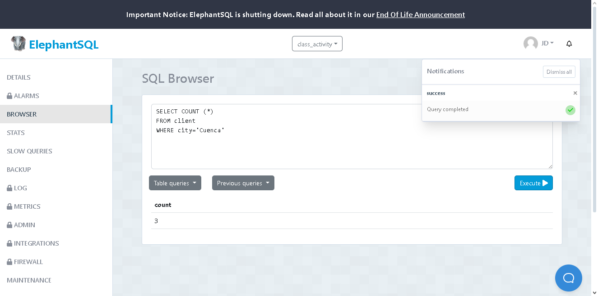
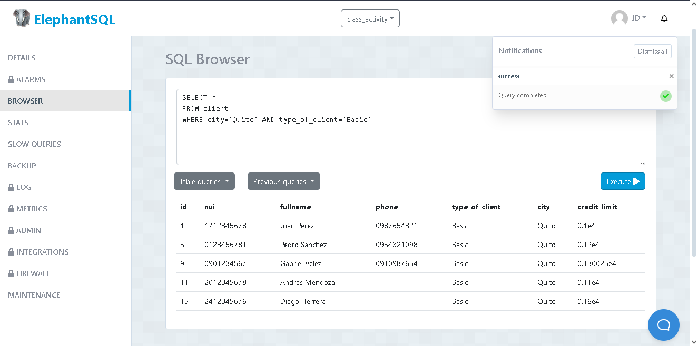
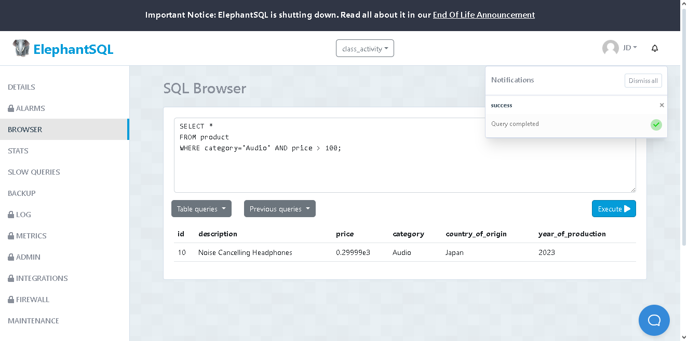
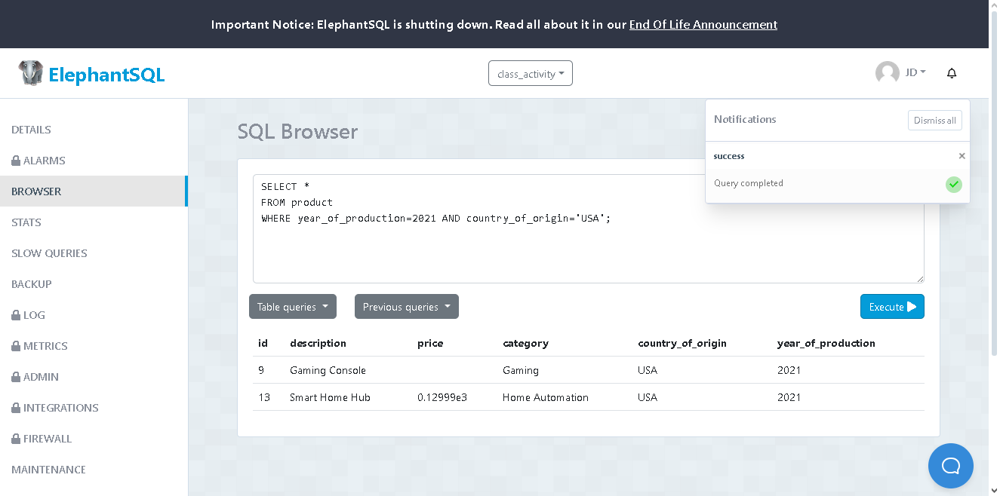
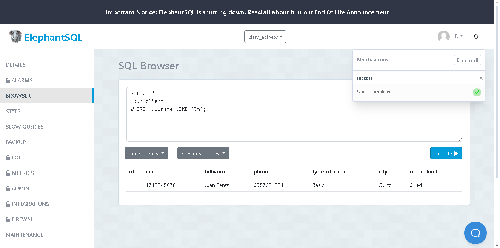
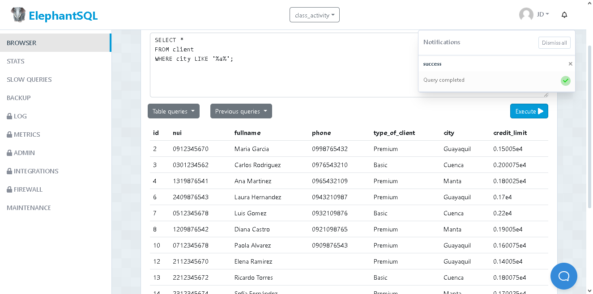

# Ejecutar las siguientes sentencias:

## Contar el número de productos de una categoría específica:
### Se utilizó el método **Count()** para poder contar el número total de productos existentes en una categoría en específico, en este caso, "Audio".

```
SELECT COUNT (*)
FROM product 
WHERE category='Audio'
```


## Contar el número de clientes en una ciudad específica:
### Se utilizó el método **Count()** para poder contar el número total de clientes existentes en una ciudad en específico, en este caso, "Cuenca".


```
SELECT COUNT (*)
FROM client 
WHERE city='Cuenca';
```



## Contar el número de productos cuyo precio está dentro de un rango específico:
### Se utilizó el método **Count()** para contar el número de productos que existen en un rango de precios en específico, y se los guardó como "price_20_200", haciendo referencia a los productos que cuestan más de USD 20 y menos de USD 200.

```
SELECT COUNT(price) AS price_20_200
FROM product 
WHERE price > 20 AND price < 200;
```


## Seleccionar clientes que viven en una ciudad específica y tienen un tipo de cliente específico:
### En este caso, se especificó qué se desea buscar con el método **WHERE**, en este caso, se buscaron cuyos clientes sean de la ciudad de Quito y su membresía (type_of_client) sea "Basic".

```
SELECT *
FROM client
WHERE city='Quito' AND type_of_client='Basic';
```




## Seleccionar productos que pertenecen a una categoría específica y cuyo precio está por encima de un valor específico:
### En este caso, también se utilizó el método **WHERE** para especificar el filtro de búsqueda que se desea realizar, en este caso, se buscan cuyos productos sean de categoría "Audio" y su precio sea mayor a USD 100.

```
SELECT *
FROM product
WHERE category='Audio' AND price > 100;
```




## Seleccionar productos que fueron producidos en un año específico y en un país de origen específico:
### Igualmente, se utilizó el método **WHERE** para especificar nuestro filtro de búsqueda, en este caso, se buscan aquellos productos que fueron producidos en el año 2021 y su país de origen o producción sea "USA".

```
SELECT * 
FROM product
WHERE year_of_production=2021 AND country_of_origin='USA';
```




## Seleccionar clientes cuyo nombre completo comience con 'J':
### En este caso, se usó el método **WHERE**, junto con el método **LIKE**. El método **LIKE** en SQL se utiliza para buscar patrones dentro de una columna, en esta instancia, se utilizó para buscar a aquellos clientes cuyo nombre empiecen con la letra "J". Se utilizó "%" para indicar que después de la J puede ir cualquier caracter.
 

```
SELECT * 
FROM client
WHERE fullname LIKE 'J%';
```




## Seleccionar clientes cuya ciudad contenga la letra 'a':
### Igualmente, se utilizó el método **WHERE** junto con el método **LIKE** para filtrar nuestra búsqueda de datos. En este caso, se desea encontrar a los clientes qcuyas ciudades de origen contengan la letra "a" en su nombre. Se utilzó "%" al inicio y al final para indicar que cualquier caracter puede estar antes o después de la letra en cuestión.

```
SELECT * 
FROM client
WHERE city LIKE '%a%';
```




### **REALIZADO POR:** Juan Gutierrez, 2do Desarrollo de Software.


